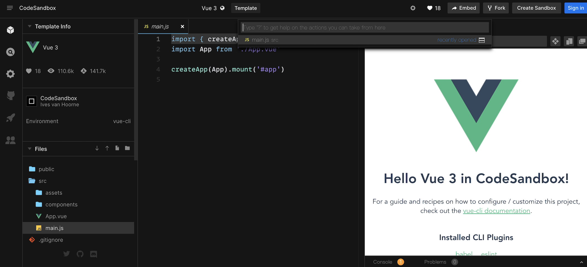

 # Vue 两个版本的区别和使用方法

 ## 今天的主要内容为

## 简述

1. [两个版本对应的文件名](#jump1)
2. [template 和 render 怎么用](#jump2)
3. [如何用 codesandbox.io 写 Vue 代码?](#jump3)


## 开始吧

###  <span id="jump1">1. Vue两个版本对应的文件名</span>
* Vue给我们提供了完整版（vue.js）和非完整版->只包含运行时版（vue.runtime.js）
* 两个版本的特点及区别
  1. 特点
    * 完整版有compiler(编译器)
    * 非完整版没有compiler
    * 而compiler占有40%的体积，显然完整版会更占内存
  2. 视图
    * 完整版视图写在HTML里，或者写在template选项中
    * 非完整版写在render函数里，用h来创建标签
    * h是尤雨溪写好传给render的
  3. cdn引入
    * 完整版的是以vue.js结尾的
    * 非完整版是以vue.runtime.js结尾的
    * 文件名不同，生成环境后缀为min.js
  4. webpack引入
    * 完整版需要引入alias
    * 默认使用的是非完整版
  5. @vue/cli引入
    * 完整版需要额外配置
    * 默认使用非完整版
 * 最佳实践：总是使用非完整版，然后配合vue-loader和vue文件
###  <span id="jump2">2. template 和 render 怎么用</span>
* template（完整）版的使用方法:
  
  ```
  new window.Vue({
    el: "#app",
    template: `
      <div @click="add">{{n}} <button>+1</button></div>
    `,
    data: {
      n: 0
    },
    methods:{
      add(){
       this.n += 1
      }
     }
   })
  ```
* render（非完整）版的使用方式:
  
  ```
  new window.Vue({
    el: "#app",
    render(h){
      return h("div", [this.n, h("button", {on:{click: this.add}}, "+1")])
    },
    data: {
      n: 0
    },
    methods:{
     add(){
       this.n += 1
     }
    }
  })
  ```
  
###  <span id="jump3">3. 如何用 codesandbox.io 写 Vue 代码?</span>
* 打开[codesandbox](http://codesandbox.io)官网
* 点击首页vue项目
  
* 开始吧
  