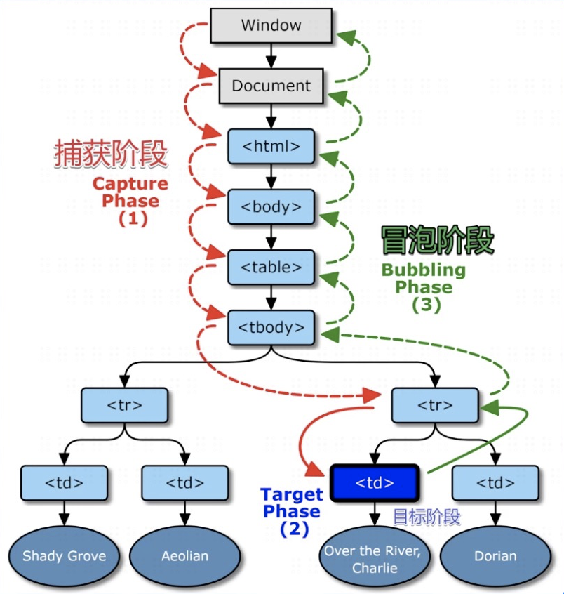

# DOM 事件模型（DOM 事件机制）

## 今天的主要内容为

## 简述 DOM 事件模型（DOM 事件机制）？

1. [DOM 是什么？](#jump1)
2. [DOM 事件是什么？](#jump2)
3. [DOM 事件模型（DOM 事件机制）](#jump3)

## 开始吧

###  <span id="jump1">1. DOM 是什么？</span>
* DOM全称 Document Object Model，即文档对象模型，是HTML和XML文档的编程接口。
* 网页其实就是一颗以根元素开头展开的大树，描述了处理网页内容的方法和接口。浏览器往window上加了一个document来操作这课树,而js用document操作网页。
###  <span id="jump2">2. DOM 事件是什么？</span>
* 事件可以在文档(Document)结构的任何部分被触发，触发者可以是用户操作，也可以是浏览器本身。事件并不是只是在一处被触发和终止；他们在整个document中流动，拥有它们自己的生命周期。
* 举例，click就是一个事件，可以在后面绑定函数执行功能。
* 点击事件
  ```css
  <div class=爷爷>
    <div class=爸爸>
     <div class=儿子>
     文字
     </div>
   </div> 
  </div> 
  即 .爷爷>.爸爸>.儿子
  给三个div分别添加事件监听fnYe/fnBa/fnEr
  ```
  * 提问一：点击了谁？
    * 点击文字，算不算点击了儿子？
    * 点击文字，算不算点击了爸爸？
    * 点击文字，算不算点击了爷爷？
    * 答案：都算
  * 提问二：调用顺序
    * 点击文字，最先调用fnYe/fnBa/fnEr中的哪一个函数？
    * 答案：都行
  * IE5认为先调fnEr,网景认为先调fnYe，无法统一，最后W3C发布了标准
    * 文档名为DOM Level 2 Events Specification
    * 规定浏览器应该同时支持两种调用顺序
    * 首先按照爷爷=>爸爸=>儿子顺序看有没有函数监听
    * 然后按照儿子=>爸爸=>爷爷顺序看有没有函数监听
    * 有监听函数就调用，并提供事件信息，没有就跳过
  * 从外向内找监听函数，叫事件捕获
  * 从内向外找监听函数，叫事件冒泡
  * 疑问：那岂不是fnYe/fnBa/fnEr都调用两次？非也
    * 开发者自己选择把fnYe放在捕获阶段还是放在冒泡阶段
###  <span id="jump3">3. DOM 事件模型</span>
* 一个事件发生之后，会在子元素个父元素之间进行传播，这种传播又分为三个阶段：
1. 事件捕获
2. 在目标节点触发事件
3. 事件冒泡
* W3C标准：首先捕获，再冒泡

* 捕获  
  一个事件在被触发之时，浏览器会自动从用户操作标签外的最上级标签中逐渐向里面检查是否有相同的事件，如果有则触发，如果没有就继续向下检查，一直到用户操作的标签。这个过程就是捕获。
* 冒泡   
  此时浏览器会继续由用户操作标签向上级标签检查，如果发现有相同的事件测触发，如果没有就继续向上级检查指导最上级为止，这过程就是冒泡。  
* W3C使用addEventListener事件绑定API，判断触发事件是在捕获阶段还是冒泡阶段。
  * 事件绑定API
    * IE5*:baba.attachEvent('onclick',fn) //冒泡
    * 网景：baba.addEventListener('click',fn) //捕获
    * W3C:baba.addEventListener('click',fn,bool)
  * 如果bool不传或为falsy
    * 就让fn走冒泡，即当浏览器在冒泡阶段发现baba有fn监听函数，就会调用fn,并提供时间信息。
  * 如果bool为true
    * 就让fn走捕获，即当浏览器在捕获阶段发现baba有fn监听函数，就会调用fn,并且提供事件信息。
  * 如果bool为true，fn就放在左边，右边空跑
  * 如果bool为true，fn就放在右边，左边空跑

### 小结
* 两个疑问
  * 儿子被点击了，算不算点击老子？
  * 那么先调用老子的函数还是先调用儿子的函数？
* 捕获与冒泡
  * 捕获说先调用爸爸的监听函数
  * 冒泡说先调用儿子的监听函数
* W3C事件模型
  * 先捕获（先爸爸=>儿子）在冒泡（再儿子=》爸爸）
  * 注意e对象被传给所有监听函数
  * 事件结束后，e对象就不存在了（e不存在的说法只针对当前知识点）
* target vs currentTarget
  * 区别 
    * e.target-用户操作的元素
    * e.currentTarget-程序员监听的元素
    * this是e.currentTarget,老师不推荐使用
  * 举例
    * div>span{文字}，用户点击文字
    * e.target就是span
    * e.currentTarget就是div
* 取消冒泡
  * 捕获但冒泡可以获不可以取消，但冒泡可以
  * 通俗来说：有人打我，我自己解决，别告诉我老子
  * 一般用于封装某些独立的组件
* 不可阻止默认动作
  * 有些事件不能阻止默认动作
  * MDN搜索scroll event,看到Bubbles和Cancelable
  * Bubbles的意思是该事件是否冒泡，所有冒泡都可取消
  * Cancelable的意思是开发者是否可以阻止默认事件
  * Cancelable与冒泡无关
  * 推荐看MDN英文版，中文版内容不全