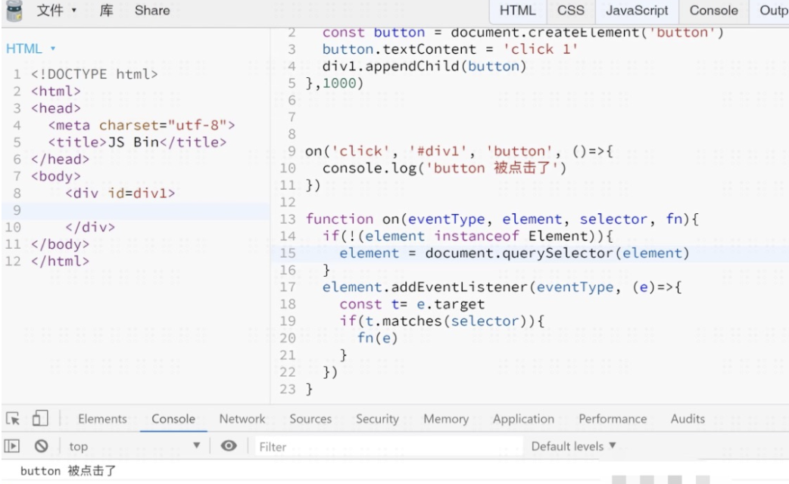

# DOM 事件委托

## 今天的主要内容为

## 简述 DOM事件委托
1. [事件委托定义](#jump1)
2. [封装事件委托](#jump2)


## 开始吧

###  <span id="jump1">1. 事件委托定义</span>

* 在JavaScript中，添加到页面上的事件处理程序数量将直接关系到页面的整体运行性能。导致这一问题的原因是多方面的。首先，每个函数都是对象，都会占用内存；内存中的对象越多，性能就越差。其次，必须事先指定所有事件处理程序而导致的DOM访问次数，会延迟整个页面的交互就绪时间。
* 捕获和冒泡允许我们实现一种被称为 事件委托 的强大的事件处理模式。
* 对事件处理程序过多问题的解决方案就是事件委托。
* 举个例子🌰
  * 场景一
  * 你要给100个按钮添加点击事件，咋办？
  * 答：监听这100个按钮的祖先，等冒泡的时候判断target是不是这100个按钮中的一个
  * 场景二
  * 你要监听目前不存在的元素的点击事件，怎么办？
  * 答：监听祖先，等点击的时候看看是不是我想要监听的元素即可
  * 优点
  * 声监听数（内存）
  * 可以监听动态元素
  * 在处理程序中，我们获取 event.target 以查看事件实际发生的位置并进行处理。


###  <span id="jump2">2. 封装事件委托</span>
写一个函数 on(‘click’, ‘#div1’,‘li’, fn)，当用户点击div1中的li时，调用fn函数,要求用到事件委托

```css

//答案一:判断target是否匹配'li'

setTimeout(()=>{
    const button = document.createElement('button')
    button.textContent= 'click 1'
    div1.appendChild(button)
},1000)

function on(eventType, element, selector, fn){
   if(!(element instanceOf Element)){
       element = document.querySelector(element)
   }
    element.addEventListener(eventType, (e)=>{
        const t = e.target
        if(t.matches(selector)){
            fn(e)
        }
    })
}

on('click', '#div1', 'button',()=>{
    console.log('button 被点击了')
})

```
```css

// 答案二:使用递归进行判断target/target的爸爸/target的爷爷

function on(eventType, element, selector, fn) {
   if(!(element instanceOf Element)){
      element = document.querySelector(element)
   }
    element.addEventListener(eventType, e => {
      let el = e.target
      while (!el.matches(selector)) {
        if (element === el) {
          el = null
          break
        }
        el = el.parentNode
      }
      el && fn.call(el, e, el)
    })
    return element

```

```css

封装好的事件委托函数

function on(eventType, element, selector, fn){
   if(!(element instanceOf Element)){
       element = document.querySelector(element)
   }
    element.addEventListener(eventType, (e)=>{
        const t = e.target
        if(t.matches(selector)){
            fn(e)
        }
    })
}
```
* 注意的是：本章节讲的是DOM的事件，JS只是调用了DOM提供的addEventListener方法，其实JS不支持事件，除非开发者手写一个事件系统。