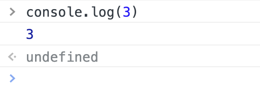

# JavaScript的基本语法

## 今天的主要内容为 🚀

####  JS 的基本语法包括：

* [什么是表达式和语句](#jump1)
* [标识符的规则](#jump2)
* [if else 语句](#jump3)
* [while for 语句](#jump4)
* [break continue 语句](#jump5)
* [label 标签](#jump6)

## 开始吧

###  <span id="jump1">什么是表达式和语句</span>

1. 表达式   

* 表达式是一组代码的集合，它返回一个值。（译注：定义比较不好理解，看下面的举例就很好懂了。）
* 每一个合法的表达式都能计算成某个值，但从概念上讲，有两种类型的表达式：有副作用的（比如赋值）和单纯计算求值的。   

  表达式x=7是第一类型的一个例子。该表达式使用=运算符将值7赋予变量x。这个表达式自己的值等于7。

  代码3 + 4是第二个表达式类型的一个例子。该表达式使用+运算符把3和4加到一起但并没有把结果（7）赋值给一个变量。
* JavaScript有以下表达式类型：

  * 算数: 得出一个数字, 例如 3.14159. (通常使用 arithmetic operators.)
  * 字符串: 得出一个字符串, 例如, "Fred" 或 "234". (通常使用 string operators.)
  * 逻辑值: 得出true或者false. (经常涉及到 logical operators.)
  * 基本表达式: javascript中基本的关键字和一般表达式。
  * 左值表达式: 分配给左值。

   ```javascript
   🫠

   1+2 表达式的值为3  
   add(1,2)表达式的值为函数的返回值  
   console.log 表达式的值为函数本身  
  ```
   

   ```javascript
   🫠
   console.log(3) 表达式的值为多少？  
   (只有函数有返回值)
    console.log(3)
    打印出来的是3
    表达式的值是 undefined
  ```
  

2. 语句  
* JavaScript 程序的执行单位为行（line），也就是一行一行地执行。一般情况下，每一行就是一个语句。
* 语句（statement）是为了完成某种任务而进行的操作，比如下面就是一行赋值语句。

  ```
  var a = 1 +3 是一个语句
  ```
  这条语句先用var命令，声明了变量a，然后将1 + 3的运算结果赋值给变量a。

二者的区别 🚀

* 表达式一般都有值，语句可能有也可能没有值
* 语句一般会改变环境（声明、赋值）
* 上面两句话并不绝对

3. 大小写敏感
    
    不要写错

    ```css
    🫠
    var a 和 var A是不同的
    object和Object是不同的
    function和Function是不同的
    具体含义后面说
    ```
5. 空格

    大部分空格没有实际意义
    ```css
   🫠
   var a = 1 和 var a=1没有区别
   加回车大部分时候也不影响
   只有一个地方不能加回车，那就是return后面
   ```
6. 变量  

   变量是对“值”的具名引用。变量就是为“值”起名，然后引用这个名字，就等同于引用这个值。变量的名字就是变量名。
   ```css
   🫠
   var = 1 ;  

   上面的代码先声明变量a，然后在变量a与数值1之间建立引用关系，称为将数值1“赋值”给变量a。以后，引用变量名a就会得到数值1。最前面的var，是变量声明命令。它表示通知解释引擎，要创建一个变量a。
   ```
   如果只是声明变量而没有赋值，则该变量的值是undefined。undefined是一个特殊的值，表示“无定义”。

   ```javascript
   🫠
   var a ;
   a //undefined
   ```
###  <span id="jump2">标识符的规则</span>   

1. 标识符是什么

* 标识符（identifier）指的是用来识别各种值的合法名称。最常见的标识符就是变量名，以及后面要提到的函数名。
* JavaScript 语言的标识符对大小写敏感，所以a和A是两个不同的标识符。

2. 标识符规则
* 第一个字符，可以是Unicode字母(包括英文字母和其他语言的字母)或（美元符号）$或（下划线）_ 或中文
* 第二个字符及后面的字符，除了上面所说，还可以有数字

3. 变量名是标识符
   
   ```javascript
   🫠
   var_= 1
   var$= 2
   var______= 6
   var 你好 = 'hi'
   ```
   合法的标识符
   ```css
   🫠
   arg0
   _tmp
   $slem
   rr
   ```
   不合法的标识符
   ```css
   🫠
   1a //第一个字符不能是数字
   23 //第一个字符不能是数字
   ***//标识符不能包含星号
   a+b//标识符不能包含加号
   -d//标识符不能包含减号或连词线
   ```
   JavaScript 有一些保留字，不能用作标识符：
   ```
   🫠
   arguments、break、case、catch、class、const、continue、debugger、default、delete、do、else、enum、eval、export、extends、false、finally、for、function、if、implements、import、in、instanceof、interface、let、new、null、package、private、protected、public、return、static、super、switch、this、throw、true、try、typeof、var、void、while、with、yield。
   ```
4. 注释
  * 源码中被 JavaScript 引擎忽略的部分就叫做注释，它的作用是对代码进行解释。
  * JavaScript 提供两种注释的写法：一种是单行注释，用//起头；另一种是多行注释，放在/*和*/之间。
  * 🚀写代码不一定要写特别多的注释
  * 注释的分类
  * 不好的注释
    * 把代码翻译成中文
    * 过时的注释
    * 发泄不满的注释
  * 好的注释
    * 踩坑的注解
    * 为什么代码会写得这么奇怪，遇到什么bug

5. 区块 block
  * avaScript 使用大括号，将多个相关的语句组合在一起(把代码包在一起)，称为“区块”（block）。
  * 对于var命令来说，JavaScript 的区块不构成单独的作用域（scope）。
    ```javascript
    {
      let a = 1
      let b = 2
    }
    ```
  * 常常与if/for/while合用

###  <span id="jump3">if else 语句</span>

    条件语句  
    JavaScript 提供if结构和switch结构，完成条件判断，即只有满足预设的条件，才会执行相应的语句。

1. if 结构 
    
   if结构先判断一个表达式的布尔值，然后根据布尔值的真伪，执行不同的语句。所谓布尔值，指的是 JavaScript 的两个特殊值，true表示“真”，false表示“伪”。
   ```
    🫠
    if结构的基本形式：

    if (布尔值)
       语句；

    // 或者
    if (布尔值)  语句；
   ```
  * 需要注意的是，“布尔值”往往由一个条件表达式产生的，必须放在圆括号中，表示对表达式求值。如果表达式的求值结果为true，就执行紧跟在后面的语句；如果结果为false，则跳过紧跟在后面的语句。
  
2. if...else 结构
* if代码块后面，还可以跟一个else代码块，表示不满足条件时，所要执行的代码。
* 语法
  * if(表达式) {语句1} else {语句2}
  * {}在语句只有一句的时候可以省略，不建议这样做
  
* 变态情况
  * 表达式里可以非常变态，如a =1 
  * 语句1里可以非常变态，如嵌套的if else
  * 语句2里可以非常变态，如嵌套的if else
  * 缩进也可以很变态，如面试题常常下套
  ```css
  a = 1
  if(a === 2)
  console.log('a')
  console.log('a等于2')

  最后结果是🫠
  a = 2
  ```
* 使用最没有歧义的写法
  * 最推荐使用的写法
    ```javascript
     if(表达式) {
       语句
     }else if (表达式) {
       语句
     }else {
       语句
     }
     ```
  * 次推荐使用的写法
    ```javascript
    function fn() {
      if(表达式)  {
         return 表达式
      }
      if(表达式)  {
         return 表达式
    }
     ```
3. switch 语句
* if...else...升级版
* 不推荐使用switch语句

###  <span id="jump4">while for 语句</span>
#### 循环语句用于重复执行某个操作，它有多种形式。

1. while 循环
* while语句包括一个循环条件和一段代码块，只要条件为真，就不断循环执行代码块。
* while语句的循环条件是一个表达式，必须放在圆括号中。代码块部分，如果只有一条语句，可以省略大括号，否则就必须加上大括号。
* 语法  
  while(表达式){语句}
  判断表达式的真假
  当表达式为真，，执行语句，执行完再判断表达式的真假
  当表达式为假，执行后面的语句
  其他：do...while用得不多
  ```
  var i = 0;
  while (i<100) {
    console.log('i 当前为：' +i);
    i = i +1;
  }
  上面的代码将循环100次，直到i等于100为止。
  ```
2. for 循环
* for语句是循环命令的另一种形式，可以指定循环的起点、终点和终止条件。
* 语法糖
  * for是while循环的方便写法
  * for语句后面的括号里面，有三个表达式：
    * 初始化表达式（initialize）：确定循环变量的初始值，只在循环开始时执行一次。
    * 条件表达式（test）：每轮循环开始时，都要执行这个条件表达式，只有值为真，才继续进行循环。
    * 递增表达式（increment）：每轮循环的最后一个操作，通常用来递增循环变量。
    ```
    for (初始化表达式; 条件; 递增表达式)
     语句

    // 或者

     for (初始化表达式; 条件; 递增表达式) {
       语句
    }
    ```
* 语法
    ```
    for(语句1;表达式2;语句3) {
     循环体
    }
    先执行语句1
    然后判断表达式2
    如果为真，执行循环体，然后执行语句3
    如果为假，直接退出循环，执行后面的语句
    ```

3. do...while循环
* do...while循环与while循环类似，唯一的区别就是先运行一次循环体，然后判断循环条件
  ```
    do
      语句
    while (条件);
     
     // 或者
    do {
       语句
    } while (条件);
  ```
* 不管条件是否为真，do...while循环至少运行一次，这是这种结构最大的特点。另外，while语句后面的分号注意不要省略。
   ```css
   🫠
   var x =3;
   var i =0;
   do {
     console.log(i);
     i++1;
   } while(i<x);
   ```
###  <span id="jump5">break continue 语句</span>
break语句和continue语句都具有跳转作用，可以让代码不按既有的顺序执行。
1. break 语句
* break语句用于跳出代码块或循环。
* break退出所有循环。
* for循环也可以使用break语句跳出循环。
  
   ```javascript
  var i = 0;

   while(i < 100) {
   console.log('i 当前为：' + i);
   i++;
   if (i === 10) break;
  }
    上面代码只会执行10次循环，一旦i等于10，就会跳出循环。
    ```

2. continue 语句
* continue语句用于立即终止本轮循环，返回循环结构的头部，开始下一轮循环。
* continue退出当前一次循环。
   ```javascript
  var i = 0;

  while (i < 100){
  i++;
  if (i % 2 === 0) continue;
  console.log('i 当前为：' + i);
  }
  上面代码只有在i为奇数时，才会输出i的值。如果i为偶数，则直接进入下一轮循环。
   ```

  如果存在多重循环，不带参数的break语句和continue语句都只针对最内层循环。

###  <span id="jump6">label 标签</span>

* JavaScript 语言允许，语句的前面有标签（label），相当于定位符，用于跳转到程序的任意位置
* 标签可以是任意的标识符，但不能是保留字，语句部分可以是任意语句。
* 标签通常与break语句和continue语句配合使用，跳出特定的循环。
* 语法
  ```javascript
  foo: {
    console.log(1);
    break foo;
    console.log('本行不会输出');
  }
  console.log(2)
  ```
* 一般不用，面试有5%的几率考到
   ```
   {
     foo:1
   }
   表示：有个代码块，里面有个标签foo,foo的内容就是1
   ```
